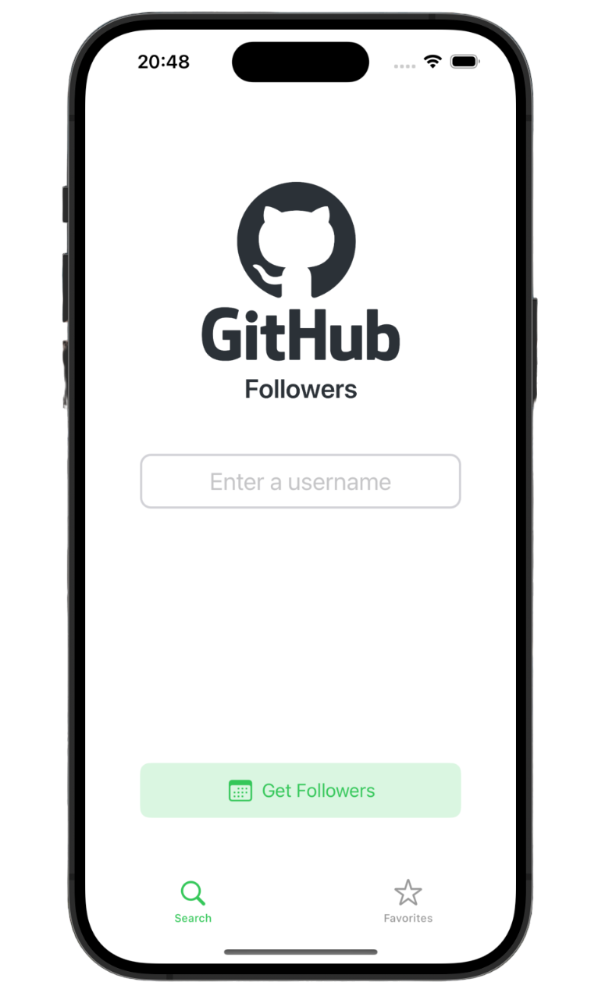
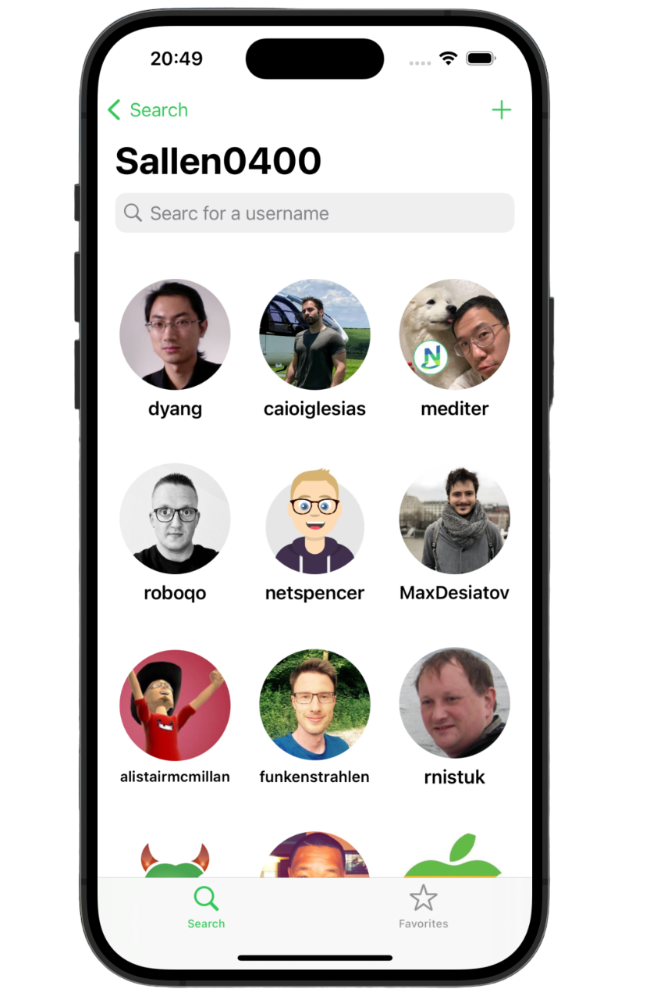
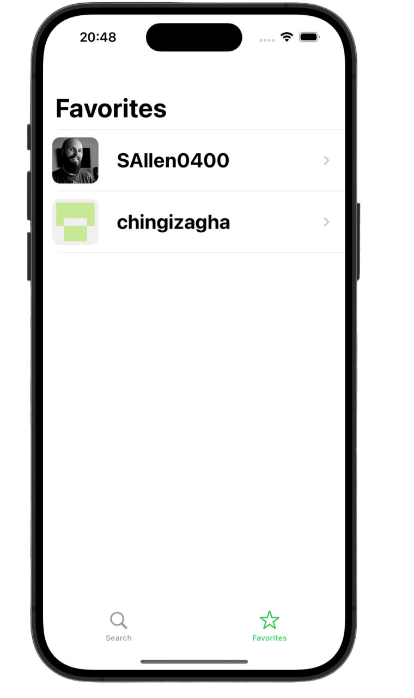

# GitHubFollowersApp

Full featured universal (iOS, iPadOS) app.

    
    
    
    

## Overview
- Written in Swift
- Uses UIKit and SwiftUI
- Designed with MVC pattern
- Pagination Support for data
- Auto layout Based
- Universal App: Run on iPhone and iPad
- Built in Xcode 15

## Design

The app has three area:

1. Search View
2. Followers View
3. Favorites View
4. User Profile View
